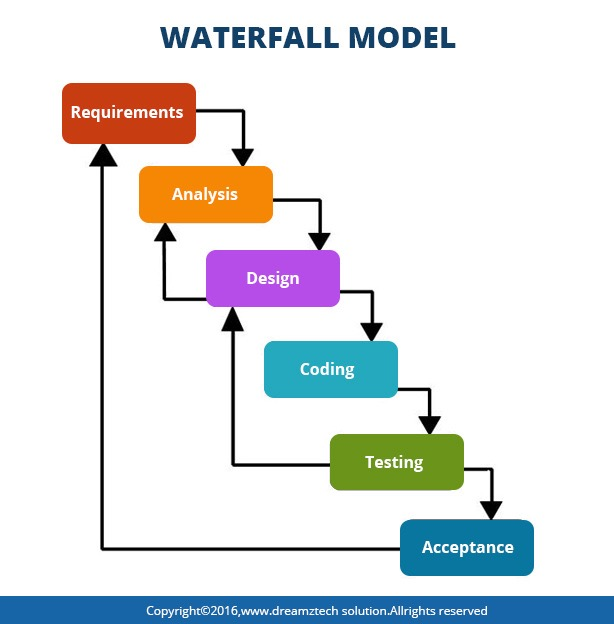
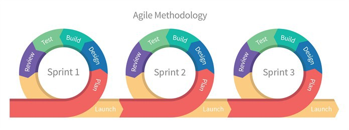
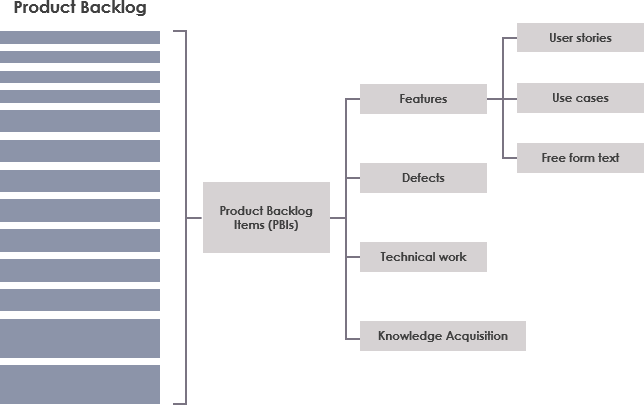
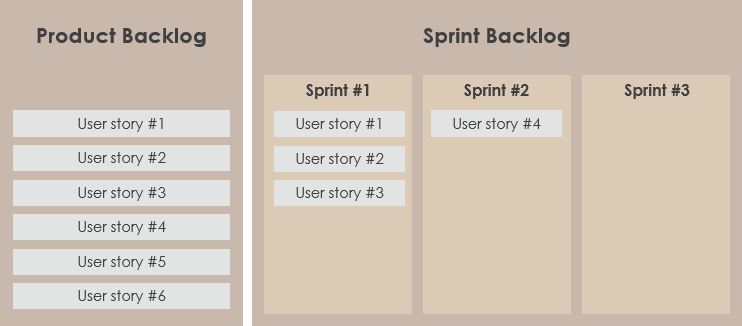
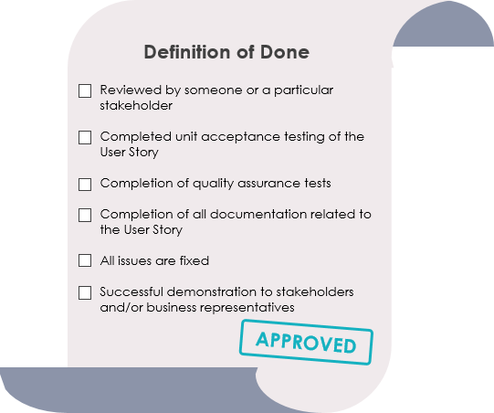

# Agile and Scrum

### **Software Development Lifecycles**

> **"** The project life cycle encompasses all the activities of the project, while the systems development life cycle
focuses on realising the product requirements **"**

**Waterfall** - `System Requirements` → `Software Requirements` -> `Analysis` → `Program Design` → `Coding` → `Testing`
→ `Operations`

___

**_`PSEUDO CODE`_** - Used a lot in Analysis and program design as well as mapping requirements and is used to show to clients
as it displays the capabilities of a system in a way that is easy for non-technological individuals to understand

**V-Model**
* `Requirement Specification` →  `Acceptance Testing`
* `Functional specification` →  `System testing`
* `Technical Specification` →  `Integrating testing`
* `Program specification` →  `unit Testing`
* `Coding`

___

**Agile**  (_**`Iterative`**_ → `Plan` → `Do` → `Check`)
**Repeat..**

### **Difference between Artifact and Artefact?**
*  **Artifact**: An object produced or shaped by human craft, especially a tool, weapon,
    or ornament of archaeological or historical interest.
*  **Artefact**: An artificial product or effect observed in a natural system, especially one introduced by the technology used in scientific investigation or by experimental error.

# **SCRUM artefact's**

**"** Scrum artefact's provide key information that is required by both the scrum team and the stakeholders in order for them to
    fully understand the product that is under development, the activities planned, as well as the activities done in the project. **"**

**Some of the most common artefact's** defined by **Scrum Framework**
## **Product Vision** 

Helps define the projects long term goal and sets overall direction and
  guides scrum team. Should be memorable; therefore it must be short and precise.
## **Sprint Goal** 

Helps create focus for the sprints, defining a objective to be met within that sprint
  with the correct backlog items. Provides guidance for development team for why the product is being built.
  Concerns the scrum team and product owner as it needs clear business goals for the coming sprint which will help organise backlog.
## **Product Backlog** 

A list of all the things required in the product, showing dynamic and best understood requirements for the product. Owned by
  product owner and contains features, requirements, enhancements, and fixes that constitute the changes to be made to the product in future releases.
  This backlog is constantly changing in response to business requirements, markets conditions or technology so is consistently updated with what is needed to be more useful to the target audience.
  
  
> 

___
  
## **Sprint backlog**

Similar to product backlog expect contains items selected for that particular sprint plus a plan for delivering the product increment and sprint goal.
  This is controlled by the development team as they decide what functionality is required for a completion as well as the order of functionalities in order to move to the next increment.
  This backlog defines the product backlog items that will be performed and changed into a "Done" increment, it makes visible the work that the development team identifies as necessary to the meet.
  
> 

___
  
## **Definition of Done** 

Every product backlog has its own acceptance criteria to define what needs to be done in order to declare an item as "Done", This allows a collective of these Requirements
  in one place so they can be referred to for each item and avoid repeating the definition of "Done" items. It contains quality criteria, constraints and overall non-functional requirements.
  

___
  
  
## **Increment** 

An increment is a sum of all the product backlog items completed during a sprint and all previous sprints. This means that at the end of the sprint, the new increment
  must be "Done", which means:
    * It must meet the Scrum Team’s Definition of "Done".
    * It must be in usable condition regardless of whether the Product Owner decides to actually release it.
## **Burn-Down Chart** 

This is a graph that gives an overview of progress over time while completing a project, as tasks are completed the graph "burns down" to zero. This is used to guide the 
  development team to a successful sprint on time with a working final product. The burn-down chart also helps the development team ascertain which objectives they are not realistically able to be complete,
  these tasks are moved back to the product backlog. 
  

___
  
* _Other required artefact's... (If needed)_

# **SCRUM Events**

> **"** At regular intervals, the team reflects on how to become more effective, then tunes and adjusts its behaviour accordingly. **"**
>> **"** Agile approaches ask that people learn from mistakes/ or identify new ways to improve on them.
 **"**

## **The 5 Key Events** 

During a SCRUM sprint, all intended to help us work efficiently and closely together, as well as improve our knowledge and become more effective in the future.
    
## **Sprint planning** 

This event kicks off each sprint, where the product owner and development team discuss backlog items (PBI's) and which ones will be included in the sprint. The product owner has overall
decision making power, but the team are expected to raise issues and push back where needed. The development team then give a forecast of how many PBI's they can deliver in the sprint, using their knowledge,
experience, resources and any facts that need to be considered. The aim of this event is to produce a "Sprint Goal" and "Sprint Backlog" that everyone agrees is realistic and achievable.
## **Daily SCRUM** 

SCRUM seeks to efficiently use time and resources, the daily scrum is an essential time boxed 10 - 15 minutes. It is called stand-up as if you stand whilst doing it, it can help keep the
meeting short and to the point. It is a opportunity for the development team to check in, assess progress towards achieving the sprint goal and review and plan their activities for the next working day.
## **Sprint Review** 

Takes place with the next event, and aims to et everything 'perfect' the first time around, but to improve continuously. A sprint-review takes place on the last day of the sprint and allows
the opportunity to show the "Done" increment to stakeholders (Customers, management and anyone else considered relevant). Demo working features of the sprint, while expecting useful feedback to be incorporated
into the product backlog for future sprints.
## **Sprint Retrospective** 

The final meeting where the team reviews what could be improved for future sprints and how it can be achieved. There is ALWAYS a opportunity to improve according the SCRUM ethos, providing
the team time in which to identify, discuss and plan this. The whole scrum team should take part, including the development team, the scrum master and the product owner. This should be collaborative effort, just like the entire
SCRUM and Agile process.
## **The Sprint**

The Sprint is an event in itself that contains all the work and all the other events that happen during the time boxed period of development.

# **SCRUM Roles**

**"** Scrum specifies three major roles that play a part in the Scrum Team: 
Product Owner, Scrum Master, and Development team member. Besides these roles, 
you should also expect to have Stakeholders such as Business Analysts in larger organization. 
The Scrum framework requires four roles **"**

   * **Product owner**: The person with the product vision
   * **Scrum master**: The Scrum expert who helps the team build the product according to
   the Scrum framework
   * **Development team**: The team members who execute the work
   * **Stakeholders**: The people, who have genuine interest in the Product, 
    keep reviewing the team’s products and progress and keep providing continual feedback.

These individuals share different tasks and responsibilities related to the final products delivery, 
however under the SCRUM ethos it is seen as a self-organizing and cross-functional team that 
collaboratively works together.

# **SCRUM Summary**

**Overall** the SCRUM framework consists of SCRUM teams, their associated roles, events, artefact's and rules, with each component in the framework serving a specific purpose and is essential to
SCRUM usage and success. Ultimately helping teams work together by encouraging teams to learn through experiences, self-organization while working on a problem and to reflect on wins and losses effectively to allow for 
continuous improvement.

