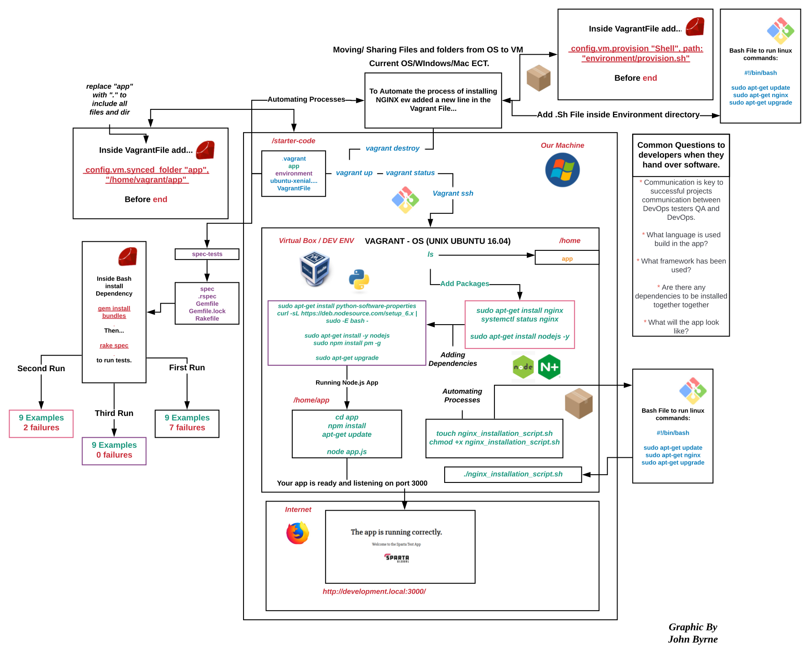
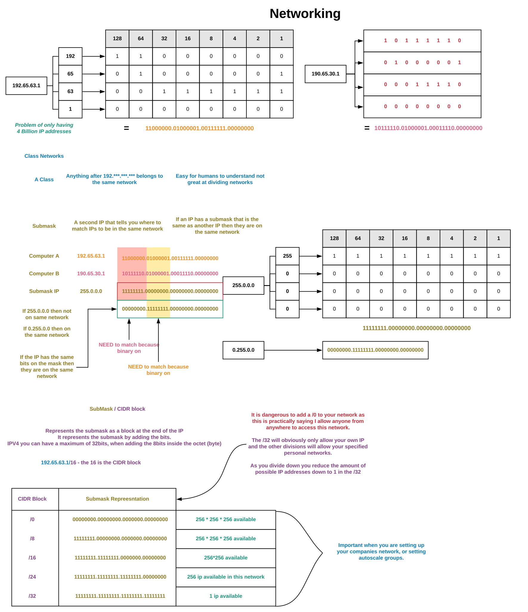
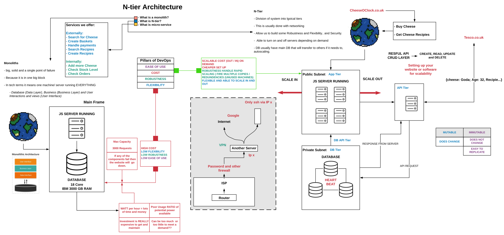
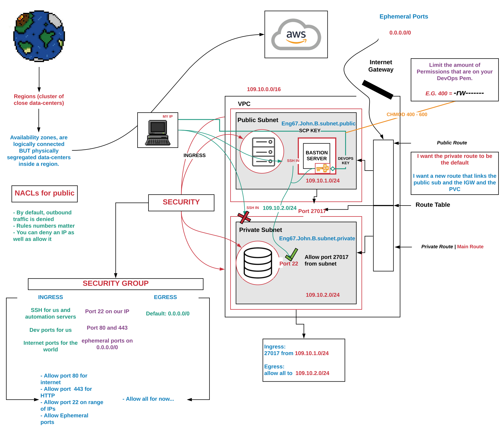
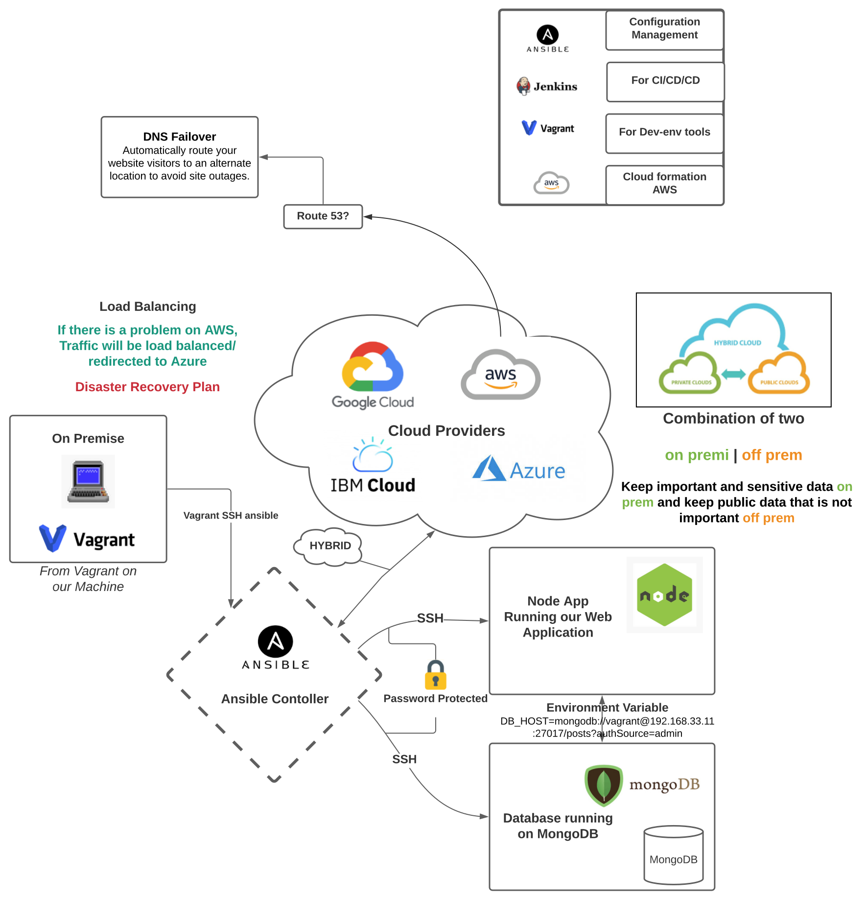
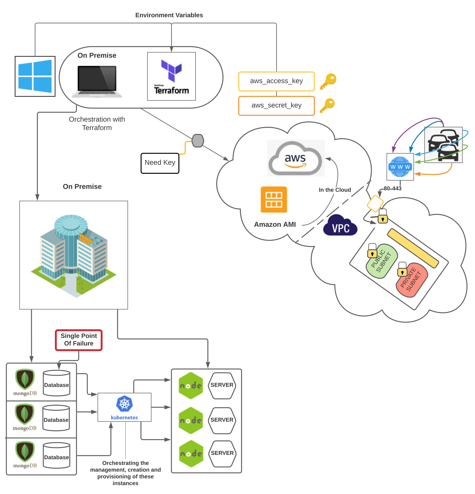

# This Repo is to help me document my Revision for Quality Gates

I need to be able to Recall information when asked, therefore good practice is to create a centralised location where information, answers and techniques for responses such as **STAR** are documented.

Also find my **Python**, **SQL**, **Agile/ SCRUM** and **DevOps** Revision here too.

# Contents
* [STAR Responses :star:](STAR.md)
* [SQL Revision :bar_chart:](SQL_Revision.md)
* [Agile and Scrum :diamond_shape_with_a_dot_inside:](Agile_and_Scrum_Revision.md)

___

# Helpful Diagrams

### Vagrant VM Environment / Setup

### Networking Diagram

### N-Tier Architecture Diagram

### VPC Setup

### Cloud Infrastructure

### Terraform Container Orchestration

_**Side Note: This diagram still needs additional changes**_

