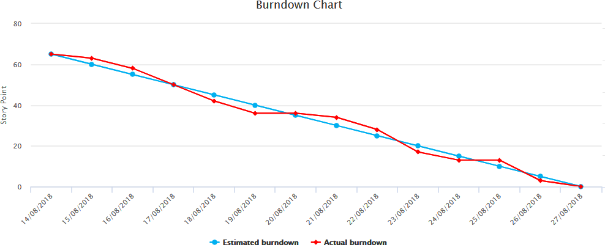

# This Repo is to help me document my Revision for Quality Gates

I need to be able to Recall information when asked, therefore good practice is to create a centralised location where information, answers and techniques for responses such as **STAR** are documented.

# Contents
* [STAR Responses :star:](#STAR-Responses)
* [SQL Revision :bar_chart:](#SQL-Revision)

---

# STAR-Responses

This section will follow the pattern of **Question** : **Answer**. **STAR :star:** stands for **Situation**, **Task**, **Action** and **Result** and is an extremely useful way of answering a question in an interview. It is a good way to show the employer how you have used, implemented and benefited from a particular tool or software.

**Situation 📋 (S)**: Describe the situation that you were in or the task that you needed to accomplish. You must describe a specific event or situation, not a generalized description of what you have done in the past. Be sure to give enough detail for the interviewer to understand. This situation can be from a previous job, from a volunteer experience, or any relevant event.

**Task 📌 (T)**: What goal were you working toward? 

**Action 👔 (A)**: Describe the actions you took to address the situation with an appropriate amount of detail and keep the focus on **YOU**. What specific steps did you take and what was your particular contribution? Be careful that you don’t describe what the team or group did when talking about a project, but what you actually did. Use the word “I,” not “we” when describing actions.

**Result 💡 (R)**: Describe the outcome of your actions and don’t be shy about taking credit for your behavior. What happened? How did the event end? What did you accomplish? What did you learn? Make sure your answer contains multiple positive results.

Examples Courtesy of [**vawizard**](Documents/STAR_Method_Interviews.pdf)

#### Question 1

* **Q** : What is DevOps? 

* **A** : DevOps is of growing importance in the IT industry, it is an approach that aims to synergise the efforts of the development and operations teams to accelerate the delivery of software products, with a minimal failure rate. DevOps Engineers focus on value-added practice, where development and operations engineers join hands throughout the product or service lifecycle, right from the design stage to the point of development. <br>
Devops requires a cultural shift that merges operations with development and demands a linked toolchain of technologies to facilitate collaborative change. Since the DevOps philosphy is at a very nascent stage, application of DevOps as well as the bandwidth required to adapt and collaborate, varies from organisation to organisation. A portfolio of DevOps skills is a very valueable as it shows tools you are familiar with which ould be perfect for an organisation already implementing that toolchain.

**Our ToolChain:**

**Plan** :  App | Software <br>


_Communicate with **Team**_ <br>

[](mailto:jbyrne@spartaglobal.com)

**Code** : Program / Code <br>
[](https://github.com/JohnByrneJames)


**Build** | **Test** | **Release** <br>


**Deploy** <br>


**Monitor** <br>


**📋 S** : DevOps is a cultural shift that merges operations with development and demands a collaborative and linked toolchain of technologies to facilitate the change that it brings. During my time at SpartaGlobal we have followed the DevOps process from end to end, The team planned in `Trello` whilst keeping constant communication over `Microsoft teams`, we sent our code to `GitHub` which allowed continuous integration with `Jenkins` finally implementing it on our `deployed` test environment inside `AWS` which when passed was `deployed` to an identical production environment also hosted on `AWS`

**📌 T** : I recieved a webpage designed using `Node`, our aim was to integrate it into a DevOps environment pipeline.

**👔  A** : To create this pipeline known as the **CICD** pipeline incorporating **Continous Integration** and **Continuous Delivery/ Deployment** I first has to connect our GitHub Repository to Jenkins which would automate the process of taking our code, running it through tests in a test environment, and finally take the code integrate it into a final version inside `GitHub` and then deploy it into our production environment. All the environments are standardised to eleminate the potential for technology issues, for example we used **Ubuntu 16.04** and the same version of our technologies, for example **NodeJS 12.0** and **MongoDB 2.3.0**

**💡 R** : This really points out the importance of the DevOps lifecycle, this toolchain helps us as a DevOp automate, test and standerdize the process of developing a software end to end. As a result of this automation I was able to garuntee that the code I push to GitHub is properly tested inside a test environment before ever reaching the point of deployment eliminating the common issue of human error. The ability to integrate code as it is pushed to GitHub totally eliminates the time consuming process of integrating code from multiple contributors at the end of the day.

#### Question 2

* **Q** : How is DevOps different from agile methodology? 

* **A** : DevOps is a culture that allows the development and the operations teams to work together. This results in continuous development, testing, integration, and monitoring of the software throughout the lifecycle. <br>
Where as Agile is a software development methodology that focuses on iterative, incremental, small, and rapid releases of software, along with customer feedback. It addresses gaps and conflicts between the customers and developers.

**📋 S** : At SpartaGlobal whilst training to become a DevOps I learnt that DevOps is a culture that allows the development and operations teams to work together, it results in the continous development, testing, integration, and minitoring of the software throughout a software lifecycle. We also used a Kanban board on Trello to plan and track the needs of customers in techniques like the STARFISH, Information Radiators and user-stories. Agile focuses on software development as a methodology in which an iterative, incremental, small and rapid releases of software take place along with customer feedback.

**📌 T** : In the Academy I was given the task to change the front page of a web application.

**👔 A** : To achieve this I set up a continous integration and delivery pipeline which was triggered every time I pushed code to my GitHub Repository. After about 20 seconds of me pushing the code the web page which was live on AWS has the new code deployed into it using the SSH protocol. Using the Kanban board and its agile initative I was able to create the CICD pipeline using the product backlog which allowed me to plan the development of the pipelines setup into weekly sprints. 

**💡 R** : As a result the pipeline was created in a single day, and included every necessary step that was required. The guidance of develop was based on the requirements specified inside the kanban board, this allowed me to stay more on track with what was needed at each stage of development. I was also able to design the pipeline in a way that was appropriate and satisfied the expectations of the tests which were run when it was being testing in the continous integration step. DevOps adds a seamless way to automate the software development process and Agile is a methodology to help track, structure and iterate the development that is happening whilst also thinking about what the customers need in the software.

### Question 3

* **Q** : What are the different Phases in DevOps? :

* **A** : <br>
* **Plan** : Initially, there should be a plan for the type of application that needs to be developed. Getting a rough picture of the development process is always a good idea.
* **Code** : The application is coded as per the end-user requirements. 
* **Build** : Build the application by integrating various codes formed in previous steps.
* **Test** : This is the most crucial step of the application development. Test the application and rebuild, if necessary.
* **Integrate** : Multiple codes from different programmers are integrated into one.
* **Deploy** : Code is deployed into a cloud environment for further usage. It is ensured that any new changes do not affect the functioning of a high traffic website.
* **Operate** : Operations are performed on the code if required.
* **Monitor** : Application performance is monitored. Changes are made to meet the end-user requirements. 

**📋 S** : During my time at SpartaGlobal we practiced the DevOps lifecycle, Starting with Continuous Integration, Delivery and Deployment. The DevOps lifecycle is quite different to traditional lifecycles like waterfall which develop a software by planning, testing, deployment and testing of a software. The difference for DevOps is that it follows an iterative approach of the lifecycle so as well as all these steps being integrated into eachother, they take place week by week to iterably create a software.

**📌 T** : At the academy we were tasked with creating a web app, so I created a Kanban board to help us worth through the process of implementing it into the DevOps Lifecycle.

**👔 A** : To outline the course I took to do this, I first planned using the Kanban board; planning my development needs, acceptance criteria and user requirements. I referred to this a lot and used the SCRUM framework to structure it into weekly sprints. I could push my code to GitHub, using Jenkins it would then be built and deployed into a test environment hosted on AWS, this deployment was tested against some unit tests provided by our trainers. The code was then integrated into our master branch of GitHub if it was successful, and finally deployed into the real-time production environment, available to customers. The production environment is monitored using software like Splunk, this allows me to see traffic activity including need to increase performance or any other maintenance needed on the code.

**💡 R** : The Process from end-to-end of integrating code into production is automated using the DevOps lifecycle and technologies that were available, including **AWS** for hosting, **Jenkins** for Integration and testing and **GitHub** for version control. The process of making a small change is a lot easier using this lifecycle, it also allowed the webapp to have as little downtime as possible as the code is integrated onto code that already exists in the environment, taking 80% less time than if the webapp was taken completely down and added to.

### Question 4


# SQL-Revision

This is my practice for **SQL**, it is a refresher of SQL as it was done it week 2 of the course.

## Queries

### Q1 - How many Orders in NWDB?

* **Query** :

```sql
SELECT COUNT(*) FROM Orders;
```

* **Response** : Number of Records: 196

### Q2 - How many orders have been shipped to the City Rio De Janeiro?

* **Query** : 

```sql
SELECT COUNT(*) FROM Orders;`
```

* **Response** : 

### Q3 - Select all orders that have been shipped to the City of Rio De Janeiro?


* **Query** :

* **Response** : 


# Agile and Scrum


### **Software Development Lifecycles**

> **"** The project life cycle encompasses all the activities of the project, while the systems development life cycle
focuses on realising the product requirements **"**

**Waterfall** - `System Requirements` → `Software Requirements` -> `Analysis` → `Program Design` → `Coding` → `Testing`
→ `Operations`


___

**_`PSEUDO CODE`_** - Used a lot in Analysis and program design as well as mapping requirements and is used to show to clients
as it displays the capabilities of a system in a way that is easy for non-technological individuals to understand

**V-Model**
* `Requirement Specification` →  `Acceptance Testing`
* `Functional specification` →  `System testing`
* `Technical Specification` →  `Integrating testing`
* `Program specification` →  `unit Testing`
* `Coding`


___

**Agile**  (_**`Iterative`**_ → `Plan` → `Do` → `Check`)
**Repeat..**


### **Difference between Artifact and Artefact?**
*  **Artifact**: An object produced or shaped by human craft, especially a tool, weapon,
    or ornament of archaeological or historical interest.
*  **Artefact**: An artificial product or effect observed in a natural system, especially one introduced by the technology used in scientific investigation or by experimental error.


# **SCRUM artefact's**

**"** Scrum artefact's provide key information that is required by both the scrum team and the stakeholders in order for them to
    fully understand the product that is under development, the activities planned, as well as the activities done in the project. **"**

**Some of the most common artefact's** defined by **Scrum Framework**
## **Product Vision** 

Helps define the projects long term goal and sets overall direction and
  guides scrum team. Should be memorable; therefore it must be short and precise.
## **Sprint Goal** 

Helps create focus for the sprints, defining a objective to be met within that sprint
  with the correct backlog items. Provides guidance for development team for why the product is being built.
  Concerns the scrum team and product owner as it needs clear business goals for the coming sprint which will help organise backlog.
## **Product Backlog** 

A list of all the things required in the product, showing dynamic and best understood requirements for the product. Owned by
  product owner and contains features, requirements, enhancements, and fixes that constitute the changes to be made to the product in future releases.
  This backlog is constantly changing in response to business requirements, markets conditions or technology so is consistently updated with what is needed to be more useful to the target audience.
  
  
> 

___
  
## **Sprint backlog**

Similar to product backlog expect contains items selected for that particular sprint plus a plan for delivering the product increment and sprint goal.
  This is controlled by the development team as they decide what functionality is required for a completion as well as the order of functionalities in order to move to the next increment.
  This backlog defines the product backlog items that will be performed and changed into a "Done" increment, it makes visible the work that the development team identifies as necessary to the meet.
  
> 

___
  
## **Definition of Done** 

Every product backlog has its own acceptance criteria to define what needs to be done in order to declare an item as "Done", This allows a collective of these Requirements
  in one place so they can be referred to for each item and avoid repeating the definition of "Done" items. It contains quality criteria, constraints and overall non-functional requirements.
  


___
  
  
## **Increment** 

An increment is a sum of all the product backlog items completed during a sprint and all previous sprints. This means that at the end of the sprint, the new increment
  must be "Done", which means:
    * It must meet the Scrum Team’s Definition of "Done".
    * It must be in usable condition regardless of whether the Product Owner decides to actually release it.
## **Burn-Down Chart** 

This is a graph that gives an overview of progress over time while completing a project, as tasks are completed the graph "burns down" to zero. This is used to guide the 
  development team to a successful sprint on time with a working final product. The burn-down chart also helps the development team ascertain which objectives they are not realistically able to be complete,
  these tasks are moved back to the product backlog. 
  


___
  
* _Other required artefact's... (If needed)_

# **SCRUM Events**

> **"** At regular intervals, the team reflects on how to become more effective, then tunes and adjusts its behaviour accordingly. **"**
>> **"** Agile approaches ask that people learn from mistakes/ or identify new ways to improve on them.
 **"**

## **The 5 Key Events** 

During a SCRUM sprint, all intended to help us work efficiently and closely together, as well as improve our knowledge and become more effective in the future.
    
## **Sprint planning** 

This event kicks off each sprint, where the product owner and development team discuss backlog items (PBI's) and which ones will be included in the sprint. The product owner has overall
decision making power, but the team are expected to raise issues and push back where needed. The development team then give a forecast of how many PBI's they can deliver in the sprint, using their knowledge,
experience, resources and any facts that need to be considered. The aim of this event is to produce a "Sprint Goal" and "Sprint Backlog" that everyone agrees is realistic and achievable.
## **Daily SCRUM** 

SCRUM seeks to efficiently use time and resources, the daily scrum is an essential time boxed 10 - 15 minutes. It is called stand-up as if you stand whilst doing it, it can help keep the
meeting short and to the point. It is a opportunity for the development team to check in, assess progress towards achieving the sprint goal and review and plan their activities for the next working day.
## **Sprint Review** 

Takes place with the next event, and aims to et everything 'perfect' the first time around, but to improve continuously. A sprint-review takes place on the last day of the sprint and allows
the opportunity to show the "Done" increment to stakeholders (Customers, management and anyone else considered relevant). Demo working features of the sprint, while expecting useful feedback to be incorporated
into the product backlog for future sprints.
## **Sprint Retrospective** 

The final meeting where the team reviews what could be improved for future sprints and how it can be achieved. There is ALWAYS a opportunity to improve according the SCRUM ethos, providing
the team time in which to identify, discuss and plan this. The whole scrum team should take part, including the development team, the scrum master and the product owner. This should be collaborative effort, just like the entire
SCRUM and Agile process.
## **The Sprint** - The Sprint is an event in itself that contains all the work and all the other events that happen during the time boxed period of development.

# **SCRUM Roles**

**"** Scrum specifies three major roles that play a part in the Scrum Team: 
Product Owner, Scrum Master, and Development team member. Besides these roles, 
you should also expect to have Stakeholders such as Business Analysts in larger organization. 
The Scrum framework requires four roles **"**

   * **Product owner**: The person with the product vision
   * **Scrum master**: The Scrum expert who helps the team build the product according to
   the Scrum framework
   * **Development team**: The team members who execute the work
   * **Stakeholders**: The people, who have genuine interest in the Product, 
    keep reviewing the team’s products and progress and keep providing continual feedback.

These individuals share different tasks and responsibilities related to the final products delivery, 
however under the SCRUM ethos it is seen as a self-organizing and cross-functional team that 
collaboratively works together.

# **SCRUM Summary**

**Overall** the SCRUM framework consists of SCRUM teams, their associated roles, events, artefact's and rules, with each component in the framework serving a specific purpose and is essential to
SCRUM usage and success. Ultimately helping teams work together by encouraging teams to learn through experiences, self-organization while working on a problem and to reflect on wins and losses effectively to allow for 
continuous improvement.

